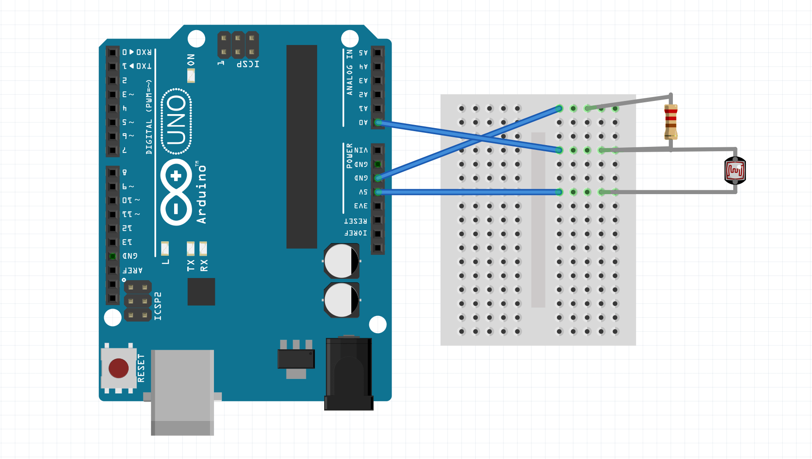
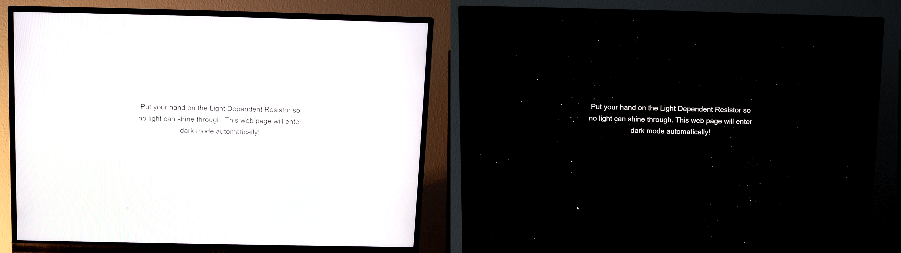

# Auto Dark Mode

[Get the example](https://github.com/fmgrafikdesign/SimpleWebSerialJS/tree/main/examples/auto-dark-mode).

### Used Hardware:

1 resistor, 1 light dependent resistor (LDR)

### Hardware Set-Up



* Connect the first leg of the light dependent resistor to the 5V supply of your Arduino.
* Connect the first leg of the resistor to the GND pin of your Arduino.
* Connect the second leg of each with each other.
* Connect the second leg of each other with the A0 pin of your Arduino.

### JavaScript

The complete code for the example can be found [here](https://github.com/fmgrafikdesign/SimpleWebSerialJS/blob/main/examples/auto-dark-mode/auto-dark-mode.html). The code listed below is enough to make the example work, but it's not quite as pretty as the full example.

```markup
<head>
    <script lang="text/javascript" src="../../dist/simple-web-serial.min.js"></script>
</head>
<body>
<h1>Cover the light sensor and this page will go dark automatically!</h1>
</body>
<style>
    body { transition: background-color .2s ease }
    .dark-mode { background: black; }
    h1 { transition: color .2s ease; }
    .dark-mode h1 { color: #fff; }
</style>

<script>
    const connection = SimpleWebSerial.setupSerialConnection({
        requestAccessOnPageLoad: true
    });

    connection.on("darkmode", function(darkmode) {
        if(darkmode) {
            document.body.classList.add("dark-mode");
        } else {
            document.body.classList.remove("dark-mode");
        }
    })
</script>
```

### Arduino

```cpp
#include <SimpleWebSerial.h>

SimpleWebSerial WebSerial;
bool darkmode = false;
// We use a second bool variable to track changes in darkmode,
// so we only send events when necessary / something changes
bool previous = false;

// the setup routine runs once when you press reset / connect to the Arduino:
void setup() {
  // initialize serial communication at 57600 bits per second:
  Serial.begin(57600);
}

// the loop routine runs over and over again forever:
void loop() {
  // Depending on your LDR, you might have to adjust this threshold.
  // Use the Serial.print command in the following line to get a feel for the values you get from you LDR while covering / not covering it.
  // Serial.println(analogRead(0));
  if(analogRead(A0) > 1000) {
    darkmode = true;
  } else {
    darkmode = false;
  }
  
  if(previous != darkmode) {
    WebSerial.send("darkmode", darkmode);
  }
  previous = darkmode;
  delay(50);        // delay in between reads for stability
}
```

### Result

When turning off the light / covering the light dependent resistor, the web application will adjust accordingly, switching to a dark background color.


