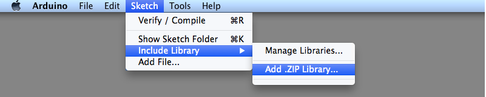

# Installation - Arduino


If you haven't worked with an Arduino before, consider following the ["Getting Started" guide](https://www.arduino.cc/en/Guide). Getting your feet wet by looking at and tinkering with some of the examples provided by the Arduino team will go a long way to help you understand basics in Arduino programming.


## Installing the library

As a first step, [install the Arduino Desktop IDE](https://www.arduino.cc/en/software) for your operating system if you haven't already.

### Via Arduino IDE Library Manager

The easiest way to get the library is to install it from the Arduino library manager:

1. Open the Arduino IDE
2. Hit CTRL + Shift + I (Windows) or ⌘ + Shift + I (Apple) to open the _Library Manager_
3. Enter "Simple Web Serial" in the search field
4. _Simple Web Serial_ should be the first result. Click on it and hit the install button.
5. When prompted to install additional dependencies, select "Install All". That's it!

### Manually

1. [Download the latest release](https://github.com/fmgrafikdesign/simplewebserial-arduino-library/releases) of the library.
2. Open the Arduino IDE.
3. Navigate to _Sketch --> Include Library --> Add .ZIP Library_.
4. Chose the .zip-Archive you downloaded in Step 1.



If you need additional help installing the library, refer to the [official Arduino library installation guide](https://www.arduino.cc/en/guide/libraries).

## Including the library

After downloading the library, include it at the top of your sketch and create an instance of it:

```c
#include <SimpleWebSerial.h>

// WebSerial can be any variable name you want.
SimpleWebSerial WebSerial;
```

And that's it! You are now ready to send events to your web application and listen to incoming events.


[arduino.md](../usage/arduino.md)

