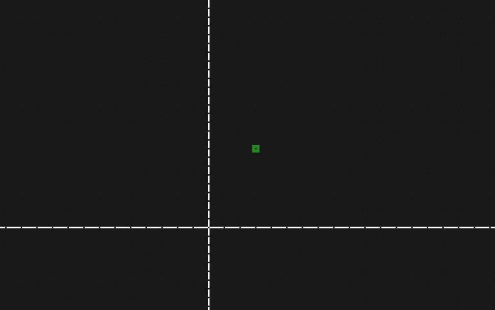

# Home in on points

[Get the example](https://github.com/fmgrafikdesign/SimpleWebSerialJS/tree/main/examples/home-in-on-point-with-2-potentiometers).

### Used Hardware:

2 potentiometers

### Hardware Set-Up


* Connect the first leg of each potentiometer to the 5V supply of your Arduino.
* Connect the second leg of each potentiometer to the GND pin of your Arduino.
* Connect the middle leg of each potentiometers to the A0 and A1 pin of your Arduino, respectively.

### JavaScript

The complete code for the game to work can be found [here](https://github.com/fmgrafikdesign/SimpleWebSerialJS/blob/main/examples/home-in-on-point-with-2-potentiometers/home-in-on-point-with-2-potentiometers.html). The code listed below is the code relevant to the communication between Arduino and your web application.

* Two separate event listeners are created
* Each listener receives a number from the Arduino
* The number is used to calculate the position of the horizontal and vertical bars

```javascript
<head>
   <script lang="text/javascript" src="https://unpkg.com/simple-web-serial@latest/dist/simple-web-serial.min.js"></script>
</head>

<div id="horizontal"></div>
<div id="vertical"></div>   
   
<script>
   const hor = document.getElementById("horizontal");
   const ver = document.getElementById("vertical");
   
   const connection = SimpleWebSerial.setupSerialConnection();
   /* This handles connecting the bars to serial input */
   connection.on("v", number => hor.style.top = 2*number + "%")
   connection.on("h", number => ver.style.left = 2*number + "%")
</script>
```

### Arduino

Two separate events are sent from the Arduino to the web application. This demonstrates how easy it is to set up multiple events. As an alternative, the numbers could be sent as an array or a single object.

Before being sent, the numbers are mapped to a number between 1 and 49, because the web application's game field consists of a 49 x 49 grid.

```cpp
#include <SimpleWebSerial.h>
SimpleWebSerial WebSerial;

int h, v;

// the setup routine runs once when you press reset:
void setup() {
  // initialize serial communication at 57600 bits per second:
  Serial.begin(57600);
}

// the loop routine runs over and over again forever:
void loop() {
  // read the input on analog pin 0:
  h = analogRead(A0);
  v = analogRead(A1);
  WebSerial.send("h", map(h, 0, 1023, 1, 49));
  WebSerial.send("v", map(v, 0, 1023, 1, 49));

  delay(20);        // delay in between reads for stability
}

```

### Result

The image below is from running the [complete example](https://github.com/fmgrafikdesign/SimpleWebSerialJS/tree/main/examples/home-in-on-point-with-2-potentiometers).


